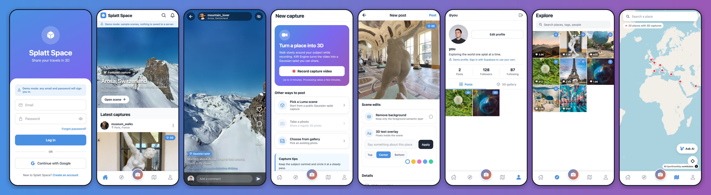
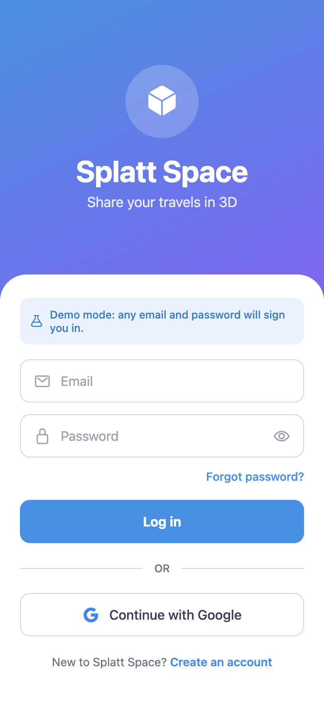
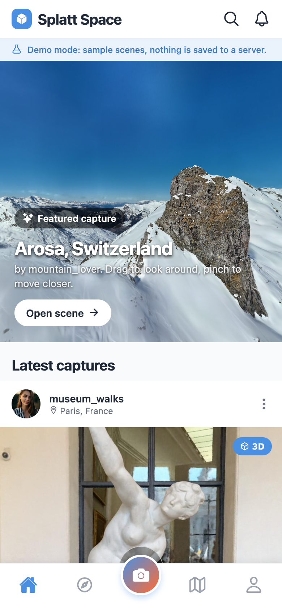
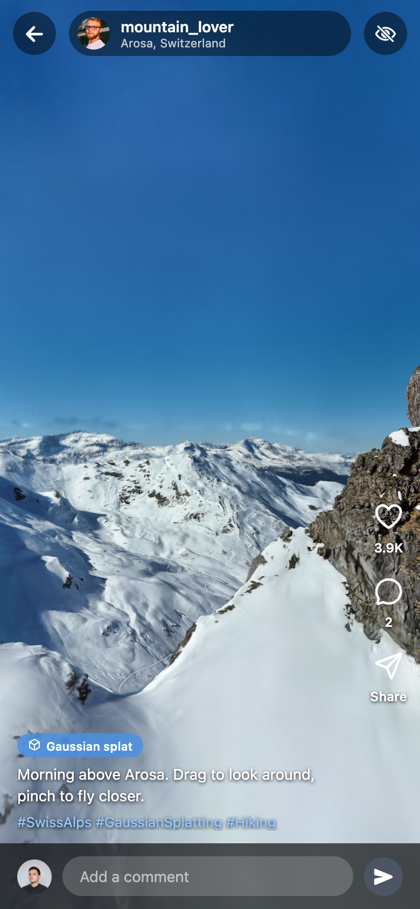
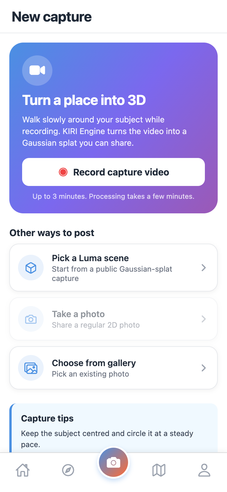
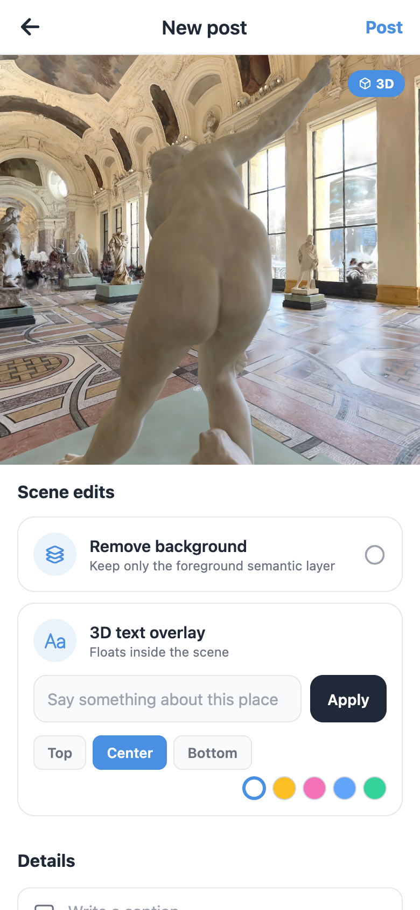
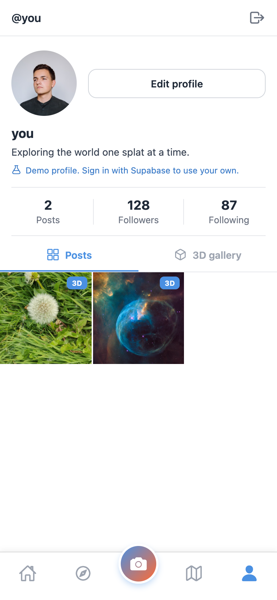
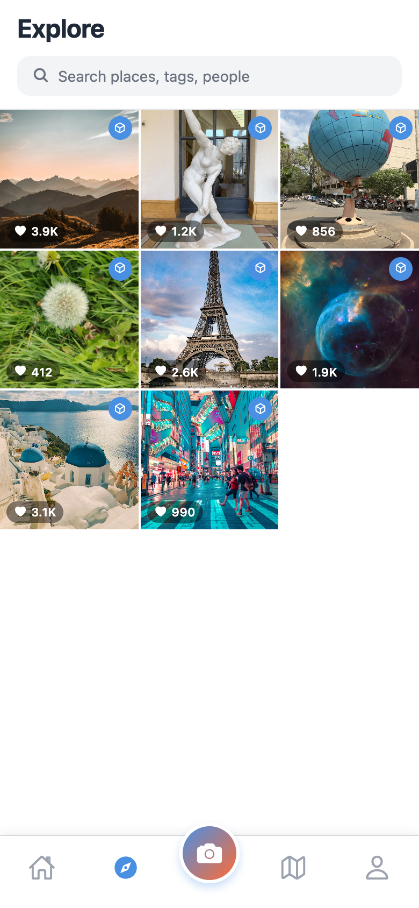
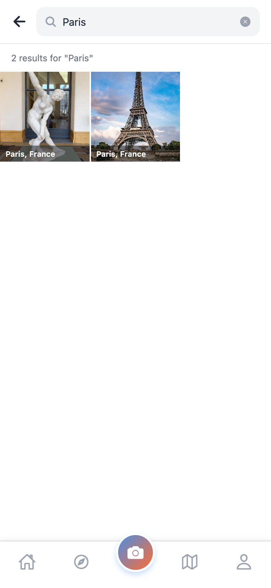
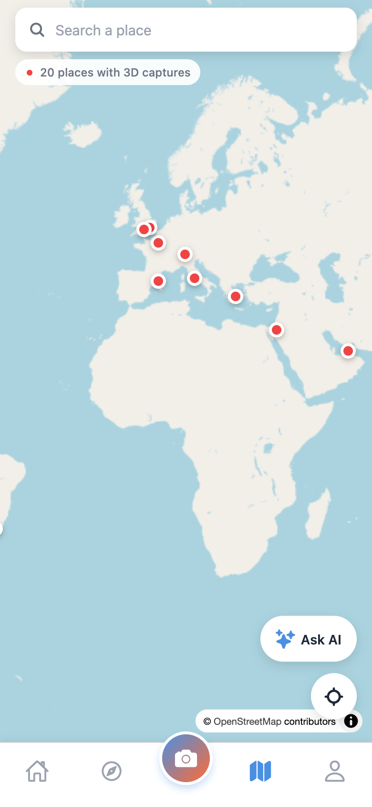

# Splatt Space

**Share your travels in 3D.** Splatt Space is a social app for Gaussian-splat
travel captures: record a place with your phone, turn it into a splat, edit it
in a live 3D scene and share it in a feed that people can walk around in.



Built with Expo Router and React Native, backed by Supabase, rendered with
Luma's Web Library on Three.js, and fed by KIRI Engine's video-to-3DGS
pipeline. Runs on iOS, Android and the web from one codebase, and ships with a
**demo mode** so you can explore everything without setting up a backend.

## Features

- **3D feed** – a live, auto-rotating featured capture at the top, then
  Instagram-style cards with a 3D badge, likes, comments and hashtags.
- **Full-screen splat viewer** – orbit, zoom and pan any Gaussian splat;
  like, comment and jump to the author's profile from an overlay UI.
- **Video capture pipeline** – record up to three minutes, upload to KIRI
  Engine, watch progress in real time through Supabase Realtime and a webhook.
- **Scene editor** – remove the background with Luma semantic masks and float
  a 3D text overlay inside the scene before posting; settings are saved with
  the post and replayed for every viewer.
- **Luma gallery** – start from curated public Luma captures when you have no
  video at hand.
- **Explore and search** – edge-to-edge grid of captures, client-side search
  across places, tags, captions and people.
- **Travel map** – MapLibre world map with a pin per capture, place search,
  geolocation and an OpenAI-powered travel assistant.
- **Profiles and social graph** – follow/unfollow, followers/following lists,
  post and 3D-gallery tabs, verified badge for large accounts.
- **Auth** – email/password and Google sign-in through Supabase; automatic
  profile creation via a database trigger.
- **Demo mode** – an in-memory backend with real public Luma captures kicks in
  whenever Supabase credentials are absent.

## Screenshots

| | | |
| :---: | :---: | :---: |
|  |  |  |
| **Login** – gradient hero, email/password and Google sign-in; the banner shows when demo mode is active. | **Feed** – live featured splat hero followed by capture cards with 3D badges, likes and comments. | **Asset viewer** – full-screen Gaussian splat with orbit controls and an overlay for likes, comments and the caption. |
|  |  |  |
| **Capture** – record a video for KIRI Engine, pick a Luma scene, or post a photo; includes capture tips. | **Editor** – background removal and a 3D text overlay applied live in the scene, then caption, location and tags. | **Profile** – avatar and primary action, stats, Posts / 3D gallery tabs and a three-column grid. |
|  |  |  |
| **Explore** – dense grid of every capture with like counts and 3D markers. | **Search** – results for places, tags, captions and people. | **Travel** – world map of captures with place search, geolocation and the AI travel assistant. |

More: [register](docs/screenshots/register.png), [travel scene modal](docs/screenshots/travel-scene.png).
Screenshots were taken from the web build in demo mode at iPhone size (390x844, 2x).

## Architecture

```
┌────────────────────────── Expo Router app (iOS / Android / Web) ──────────────────────────┐
│  app/(auth)  login · register                                                            │
│  app/(tabs)  feed · explore · upload · travel · profile · search                          │
│  app/        asset-viewer · edit-asset · kiri-processing · user/[id](/followers|following)│
│                                                                                          │
│  src/contexts   AuthContext (session)      PostContext (in-memory post cache)           │
│  src/hooks      useFeed (server + local like state)                                      │
│  src/services   api ──▶ SupabaseAPI | DemoAPI      kiri · openai · luma · storage       │
│  src/components SplatViewer ──▶ WebFrame (WebView | iframe) ──▶ Luma + Three.js page     │
└───────────┬───────────────────────────┬──────────────────────────────┬───────────────────┘
            │ supabase-js               │ HTTPS                        │ HTTPS
            ▼                           ▼                              ▼
   ┌─────────────────┐        ┌──────────────────┐            ┌────────────────┐
   │   Supabase      │        │   KIRI Engine    │            │  OpenAI        │
   │ auth · postgres │◀───────│ video → 3DGS     │            │ gpt-4o-mini    │
   │ realtime · edge │ webhook│                  │            │ travel chat    │
   │ fn kiri-webhook │        └──────────────────┘            └────────────────┘
   └─────────────────┘
```

**Navigation** – file-based routes with Expo Router. The root layout shows an
animated splash, then redirects unauthenticated users to `(auth)/login`; the
`(tabs)` group hosts the five main screens with a raised capture button.

**Data** – `src/services/api.ts` exposes one `DataBackend` interface. In
Supabase mode it maps to tables through `supabase-api.ts`; in demo mode to
`demo.ts`. Likes and comment counts are cached locally (`storage.ts` +
`PostContext`) so optimistic updates survive navigation.

**Supabase schema** (`supabase/migrations`):

```
auth.users ─1:1─ profiles ─1:N─ posts ─1:N─ likes
                    │              └────1:N─ comments
                    ├─N:M follows (follower_id → following_id)
                    └─1:N kiri_tasks (capture jobs, updated by the webhook)
```

Triggers create a profile on sign-up and keep `posts_count`, `likes_count`,
`comments_count`, follower counts and `updated_at` in sync. Row Level Security
lets everyone read and only owners write. Details in
[docs/supabase-setup.md](docs/supabase-setup.md).

**Splat rendering** – `src/lib/splatViewerHtml.ts` builds a self-contained
page (Three.js 0.157 + `@lumaai/luma-web` via an import map). `WebFrame`
renders it in a `react-native-webview` on native and a same-origin `iframe` on
web, and forwards `postMessage`/`injectJavaScript` in both directions, so the
same page powers the feed hero, the viewer, the editor and the travel modal.
See [docs/capture-pipeline.md](docs/capture-pipeline.md).

**Capture flow** – Capture tab → `kiriService.uploadVideo` → `kiri_tasks` row →
KIRI webhook → Supabase Edge Function → Realtime → `kiri-processing` →
`edit-asset` → post. See [docs/kiri-webhook.md](docs/kiri-webhook.md).

**Travel assistant** – `src/services/openai.ts` calls `gpt-4o-mini` with a
travel-only system prompt; without a key it returns canned demo replies.

## Tech stack

| Layer | Choice |
| --- | --- |
| Framework | Expo SDK 54, React Native 0.81, React 19, TypeScript 5.9 |
| Navigation | Expo Router 6 (file-based), React Navigation bottom tabs |
| Backend | Supabase (Auth, Postgres, Realtime, Edge Functions) |
| 3D | `@lumaai/luma-web` 0.2 + Three.js 0.157 (Gaussian splats), MapLibre GL 3 (map) |
| Capture | KIRI Engine 3DGS video API |
| AI | OpenAI Chat Completions (`gpt-4o-mini`) |
| State | React Context, AsyncStorage |
| Media | expo-image-picker, expo-linear-gradient, @expo/vector-icons |
| Web | react-native-web, static export |
| Tooling | ESLint (expo config), Playwright for screenshots |

## Getting started

### Prerequisites

- Node.js 18 or newer and npm
- Expo Go on a device, or Xcode / Android Studio for simulators
- Optional: a Supabase project, a KIRI Engine API key, an OpenAI API key

### Install and run

```bash
git clone https://github.com/yc9954/splatt_space.git
cd splatt_space
npm install
cp .env.example .env      # optional; leave empty for demo mode
npx expo start            # press i (iOS), a (Android) or w (web)
```

Useful scripts:

```bash
npm run web          # dev server for the browser
npm run export:web   # static web build into dist/
npm run typecheck    # tsc --noEmit
npm run lint         # expo lint
```

### Environment variables

| Variable | Needed for |
| --- | --- |
| `EXPO_PUBLIC_SUPABASE_URL` | Real auth and data (leave blank for demo mode) |
| `EXPO_PUBLIC_SUPABASE_ANON_KEY` | Same |
| `EXPO_PUBLIC_KIRI_API_KEY` | Recording a capture video |
| `EXPO_PUBLIC_OPENAI_API_KEY` | Live answers in the travel assistant |
| `EXPO_PUBLIC_LUMA_API_KEY` | Optional image-to-3D via the Luma API |
| `EXPO_PUBLIC_DEMO_MODE` | `true` forces demo mode even with Supabase configured |

All variables are read in `src/lib/config.ts`; see
[docs/environment.md](docs/environment.md).

### Supabase setup (optional)

1. Create a project and run the four files in `supabase/migrations` in the
   SQL editor (or `npx supabase db push`).
2. Put the project URL and anon key in `.env` and restart with
   `npx expo start --clear`.
3. For video captures deploy the Edge Function and register its URL as a
   KIRI webhook: `npx supabase functions deploy kiri-webhook`.

Step-by-step guides: [docs/supabase-setup.md](docs/supabase-setup.md),
[docs/kiri-webhook.md](docs/kiri-webhook.md).

### Taking screenshots

The images in `docs/screenshots` come from the static web export in demo
mode, captured with Playwright at 390x844 @2x. Rebuild with
`EXPO_PUBLIC_DEMO_MODE=true npm run export:web`, serve `dist/` and run a script
that logs in with any credentials and visits `/feed`, `/explore`, `/upload`,
`/profile`, `/travel`, `/asset-viewer?postId=p-1` and `/edit-asset`.

## Project structure

```
splatt_space/
├── app/                      # Expo Router routes
│   ├── _layout.tsx           # providers, splash, auth redirect
│   ├── (auth)/               # login, register
│   ├── (tabs)/               # feed, explore, upload, travel, profile, search
│   ├── asset-viewer.tsx      # full-screen splat + comments
│   ├── edit-asset.tsx        # scene editor + post composer
│   ├── kiri-processing.tsx   # capture progress
│   └── user/[id].tsx         # other profiles (+ followers/following)
├── src/
│   ├── components/           # PostCard, SplatViewer, WebFrame(.web), ProfileHeader, ...
│   ├── constants/            # theme tokens, sample Luma scenes
│   ├── contexts/             # AuthContext, PostContext
│   ├── hooks/                # useFeed, useColorScheme
│   ├── lib/                  # config, supabase client, splat/map HTML builders, helpers
│   ├── services/             # api, supabase-api, demo, kiri, openai, luma, storage
│   └── types/                # shared TypeScript types
├── assets/images/            # icon, splash, adaptive icons
├── docs/                     # guides + screenshots
├── supabase/
│   ├── migrations/           # 001 schema · 002 seed · 003 follows · 004 kiri_tasks
│   └── functions/kiri-webhook/
├── app.json / app.config.js  # Expo manifest (+ env mirroring)
└── .env.example
```

## Roadmap

- Upload thumbnails and capture videos to Supabase Storage instead of
  referencing device URIs
- Profile editing (avatar, bio) and account settings
- Notifications for likes, comments and finished captures
- Comments and likes pagination, infinite feed scrolling
- Share sheet and deep links to captures (`splatt-space://asset/<id>`)
- Direct image-to-3D through the Luma API
- Offline cache of recently viewed splats
- Dark theme and accessibility pass

## History

This repository merges two earlier projects: **travelapp** (the functional
Expo base with Supabase, the Luma viewer, the KIRI pipeline and the OpenAI
chat) and **travel_app_designed** (a bare React Native redesign with four
Figma-styled screens). Both histories are preserved; the redesign's login,
feed card, profile header, capture flow and tab bar were ported into the Expo
screens, and the result was rebranded as Splatt Space.

## License

[MIT](LICENSE)
